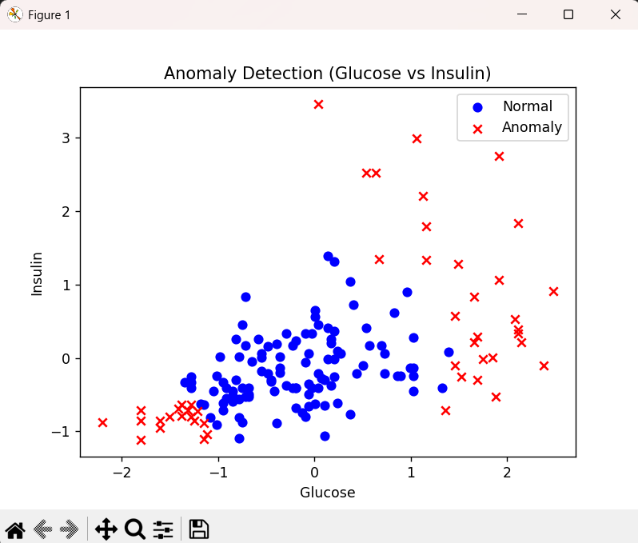

This is the working implementation of the course taught by Instructor Andrew NG, in collaboration 
of DeepLearning.AI with Stanford Online.

This implmentation uses anomaly detection algorithm on a diabetes.csv file, where we have taken two features
namely, the blood sugar level and Insulin Level.

The Algorithm marks anomalies that are outliers, and predict label y = 1, where the algorithm think that the
patient is dibetic, and 0, where it does not.

I have also included an image, where we can see the outliers or anomalies marked as a red cross, which denotes
that the patient may be diabetic, but still the algorithm shows high recall, which further needs to be tuned

